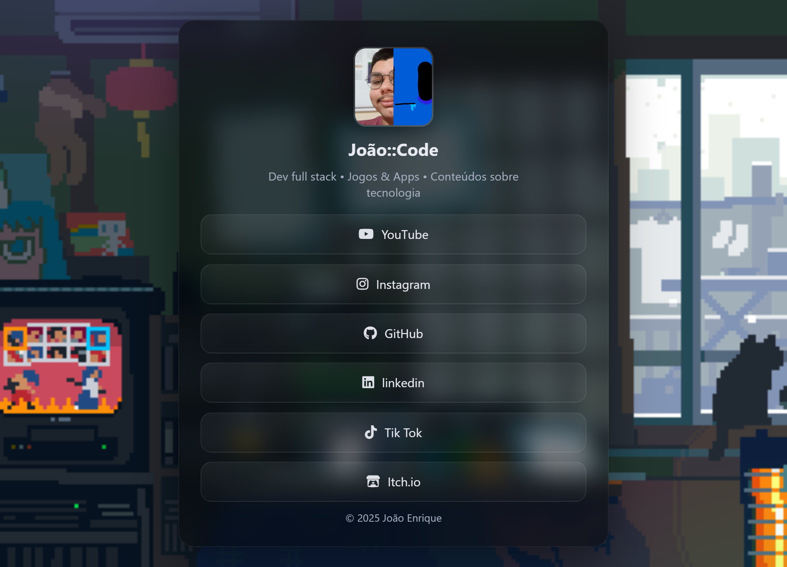

<h1 align="center">🌐 LINKTREE 🌐</h1>

###



<h4 align="center"><a href="https://joao-enrique.github.io/linkar-redes/">Confira o projeto aqui</a></h4>

👾 Bem-vindo ao **Linktree Retrô** — uma página simples, estilizada em **pixel art**, para reunir e compartilhar todos os seus links de forma prática e nostálgica. 🚀

###

<h2 align="left">🕹️ Funcionalidades</h2>

###
- ✅ Lista de links centralizada e de fácil acesso  
- ✅ Visual retrô em pixel art  
- ✅ Links para redes sociais, portfólio e projetos  
- ✅ Design 100% responsivo  

###

<h2 align="left">🧠 Como funciona?</h2>

###
1. Abra a página pelo link acima.  
2. Clique no botão correspondente ao link desejado.  
3. A navegação é feita de forma rápida e direta.  

Tudo em uma interface retrô divertida 🎨

###

<h1 align="left">💾 Tecnologias utilizadas</h1>

###
<div align="left">
  
  
  
  
  
</div>

###

<h1 align="left">🧪 Como rodar?</h1>

###
<p align="left">1. Faça o clone do projeto:</p>

```bash

https://github.com/joao-enrique/linkar-redes.git

```

<p align="left">2. Abra o <code>index.html</code> em seu navegador.</p>
<h1 align="left">👨‍💻 Estrutura</h1>

📁 linktree-retro<br>
├── index.html # Estrutura principal<br>
├── style.css # Visual retrô/pixel art<br>
├── script.js # Animações e interações (opcional)<br>
└── README.md # Você está aqui!

<h1 align="left">🔮 Futuras melhorias</h1>

Animações em 8-bit 🎮

Temas alternativos (noite/dia) 🌙☀️

Ícones personalizados retrô ✨

QR Code para compartilhamento rápido 📱

<h1 align="left">📬 Contato</h1> <p align="left">Feito com ❤️ por João Enrique.</p> <div align="left"> <a href="https://www.instagram.com/joao__dev/" target="_blank">  </a> <a href="https://www.linkedin.com/in/joao-enrique-dev/" target="_blank">  </a> <a href="https://www.youtube.com/@joao__dev" target="_blank">  </a> </div>

> “Todos os seus links reunidos em um só lugar, como um inventário retrô.” – Pixel Links


